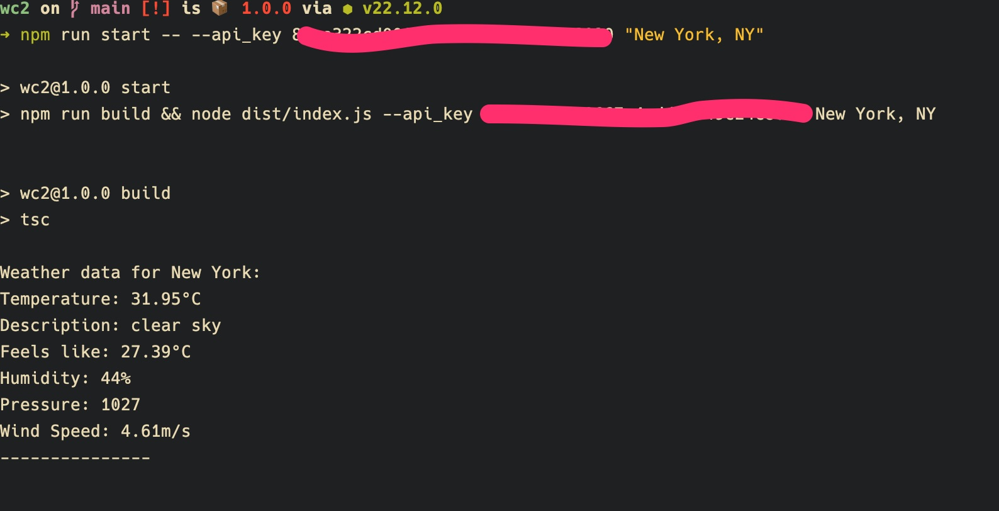
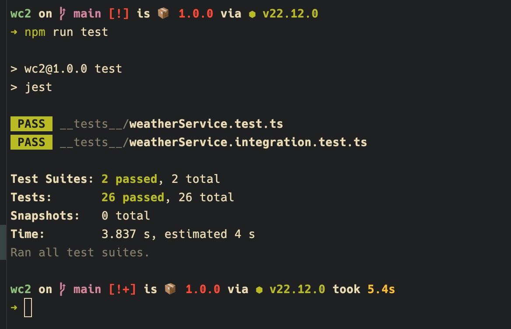
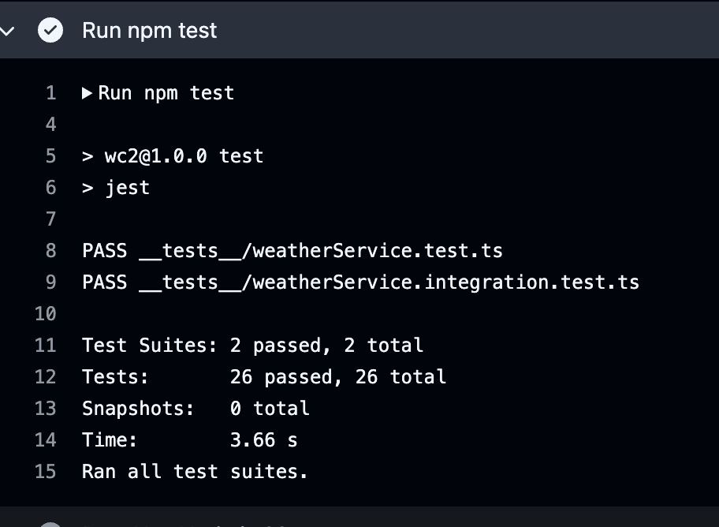

 [](https://github.com/jonathan-gartland/weather-cli/actions/workflows/main.yml)  


# weather-cli demo app
Built with these technologies:  
 

 
 
  
  


A simple demo app for the OpenWeatherMap API, with some tests.
  
You will need a valid OpenWeatherMap API Key to run this app.  
You can get one [here](https://home.openweathermap.org/users/sign_up).  
  

## Installation  
```
$> git clone https://github.com/jonathan-gartland/weather-cli.git
$> cd weather-cli
$> npm install
$> npm run build
```  
  
### Either of the following commands will run the app:  
## Usage  
```
$> node dist/index.js --api_key <YOUR_API_KEY> "New York" "Portland, ME" "Honolulu, HI" "Anchorage" "04652"
```
### or
``` 
$> npm run start -- --api_key <YOUR_API_KEY> "New York" "Portland, ME" "Honolulu, HI" "Anchorage" "04652" 
```


### Here is an example running a test for New York, NY:


  
  
## Testing  
To run the tests, a local .env file with the WEATHER_API_KEY is required.  
```
echo "WEATHER_API_KEY=<YOUR_API_KEY>" > .env
npm run test
```  
## Local
  

## GitHub Actions  
#### These run any time a push is made to the main branch. 
  
